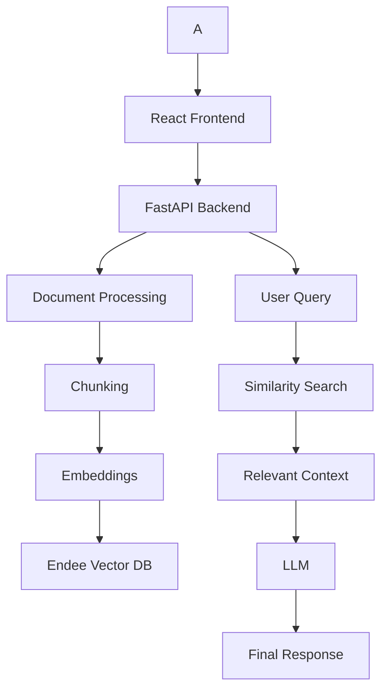

  <picture>
      <source media="(prefers-color-scheme: dark)" srcset="docs/assets/logo-dark.svg">
      <source media="(prefers-color-scheme: light)" srcset="docs/assets/logo-light.svg">
      
  </picture>

  <b>AI Knowledge Assistant built using Endee for RAG, semantic search, and voice-enabled interaction</b>

  
  
  
  

---

# 🚀 Endee AI Knowledge Assistant (RAG + Voice Enabled)

A production-ready AI application built using the **Endee vector database** for semantic search, document understanding, and intelligent question answering using Retrieval-Augmented Generation (RAG).

---

## 🧠 Project Overview

- 📄 Upload documents (PDF / TXT)  
- 🔍 Perform semantic search using Endee  
- 💬 Ask contextual questions  
- 🎤 Voice input support (speech-to-text)  
- ⚡ Accurate AI-generated responses using RAG  

---

## 🏗️ System Architecture

🔥 Key Features

✅ RAG (Retrieval-Augmented Generation)

Context-aware responses

Reduced hallucination

✅ Endee Integration

Fast vector search

Scalable retrieval system

✅ Document Processing

PDF & TXT support

Smart chunking

✅ Premium UI

Dark modern design

Smooth chat experience

🛠️ Tech Stack

Frontend

React.js

Axios

Backend

FastAPI

Uvicorn

AI / ML

Sentence Transformers / OpenAI

RAG Pipeline

Vector Database

Endee

⚙️ Setup

git clone https://github.com/kruthikn7/endee.git
cd endee

Backend

cd backend
python -m venv venv
venv\Scripts\activate
pip install -r requirements.txt
uvicorn app.main:app --reload

Frontend

cd frontend
npm install
npm start

▶️ Usage

Upload document

Endee retrieves relevant data

AI generates response

🎥 Demo

✅ Assignment Requirements Completed

⭐ Starred Endee repository

🍴 Forked Endee repository

🛠️ Built project on fork

🤖 Implemented RAG system

